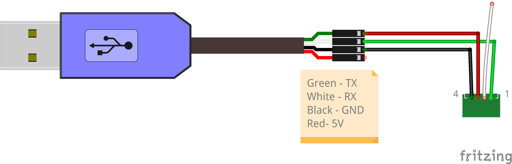

# Debian-on-QNAP-TS-451DeU
The QNAP TS-451DeU NAS server is only capable for operating in a headless mode.  All configuration and maintenance is performed throught the web interface.  The server has a graphics processor but does not have a port.  To install an alternate OS on the hardware some additional steps are required.  The following details the procedure for installation of the Debian operating system on this hardware.

## Hardware
1. QNAP TS-451DeU or similar QNAP hardware
2. USB Serial interface[^1]
3. JST PH 4-pin female connector[^2]
4. USB drive
   
## Procedure
1. Backup the QNAP
   1. Open an SSH connection to the QNAP.
   2. Backup the firmware.
      ```bash
      cat /dev/mmcblk0boot0 > mmcblk0boot0
      cat /dev/mmcblk0boot1 > mmcblk0boot1
      cat /dev/mmcblk0rpmb > mmcblk0rpmb
      ```
      Store these files for recovery.
3. Create Debian installer on USB drive[^3]
   1. Download iso
   2. Copy to USB
      ```bash
      cp debian.iso /dev/sdX
      sync
      ```
4. Power down QNAP
5. Connect serial interface to QNAP
   1. Remove the top cover of the QNAP.
   2. The serial interface header (COM1) is located at the back near the power supply and in front of the middle fan.  Connect the JST PH 4-pin female cable to the header.
      
      Use the following pin-out. _Do not connect the 5V power wire from the USB cable since the QNAP is already powered._
      
7. Open a serial console
   ```bash
   sudo screen /dev/ttyUSB0 115200
   ```
8. Power on QNAP
9. After system beep press `ESC` to enter the BIOS setup

## References
- https://www.reddit.com/r/qnap/comments/ttm5db/gaining_access_to_the_ts451deu/
- https://www.cyrius.com/debian/kirkwood/qnap/ts-219/install/
- https://www.desgehtfei.net/serielle-konsole-fuer-qnap-mit-arduino/
- https://wiki.qnap.com/wiki/System_Recovery_Mode
- https://www.reddit.com/r/qnap/comments/s1p1g8/truenas_core_on_the_qnap_ts451deu

[^1]: https://www.adafruit.com/product/954
[^2]: https://www.adafruit.com/product/3955 
[^3]: https://www.debian.org/releases/stable/amd64/ch04s03.en.html

